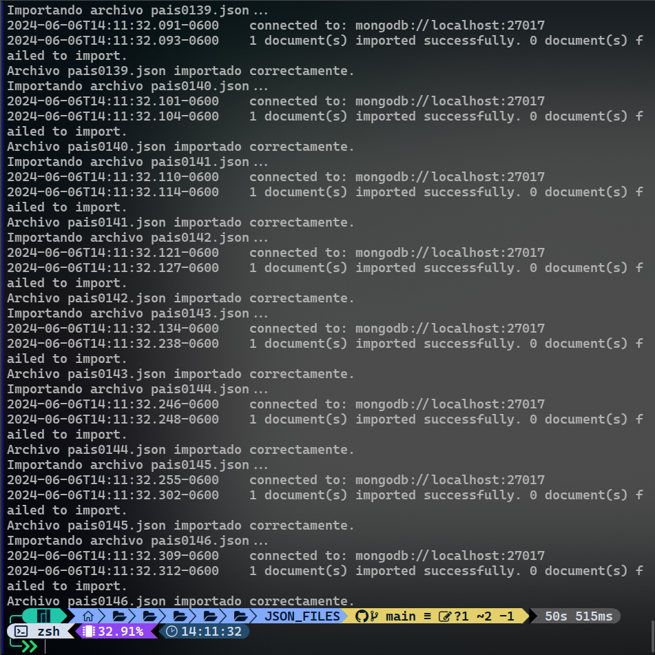
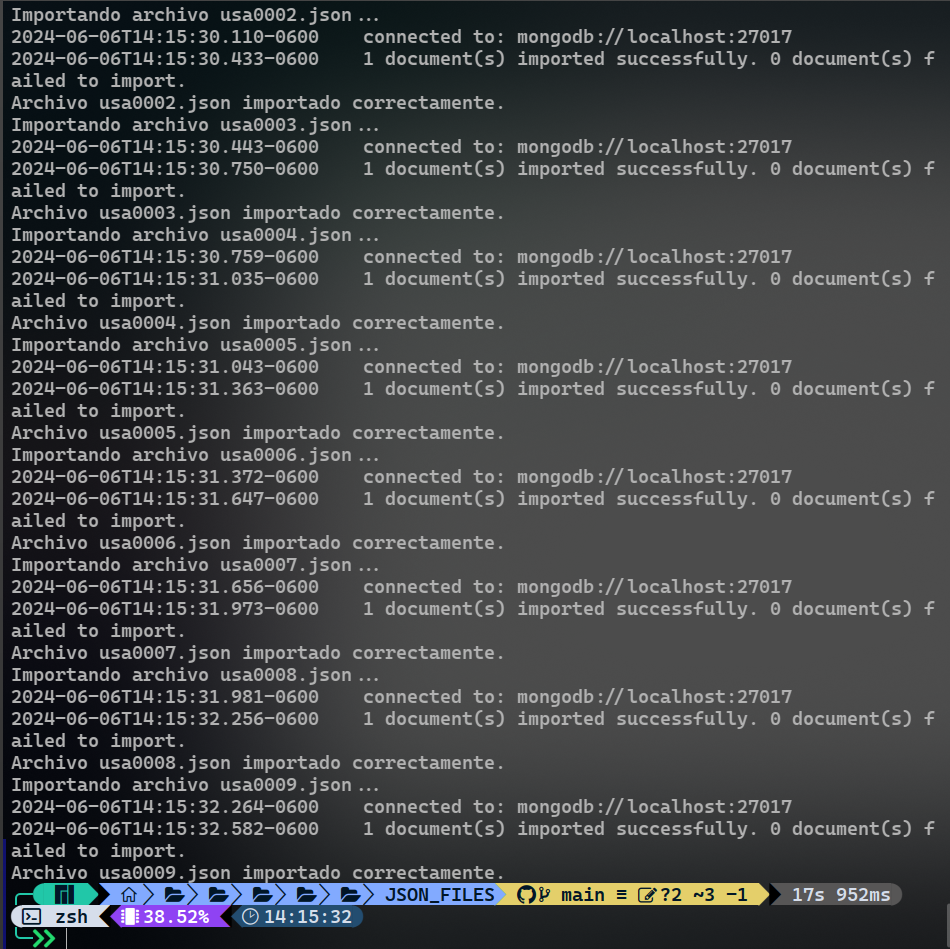
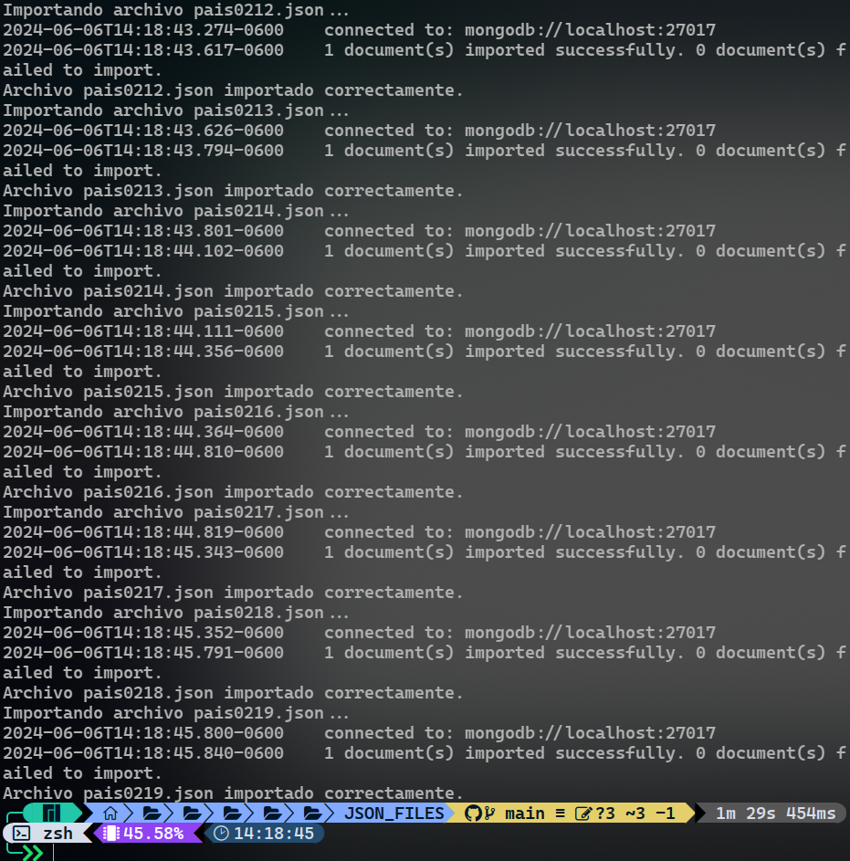

# BdNoSQL-MUBI
Proyecto final para la materia de bases de datos no estructuradas FES - Acátlan

Diagrama Entidad Relación Relacional:
[ERD](https://lucid.app/lucidchart/06694025-a346-448c-9cb1-250631f21fe5/edit?viewport_loc=-541%2C-111%2C1921%2C811%2C0_0&invitationId=inv_940f940e-6926-4f73-8620-32649d791991)
[GRAFO](https://lucid.app/lucidchart/75d42e64-8d42-462d-9f21-a82353d54eff/edit?view_items=F.gIO.M4fgD1&invitationId=inv_cd6dc916-0b39-465c-bb61-002e6af7b6f9)

Google Drive:
[Drive](https://drive.google.com/drive/folders/1ufDXsd4-4lmpKyHwCV4Bd8sc1aIvHhlg?usp=sharing)

* Se tiene que pedir acceso al drive para edición
* El Drive es solo para archivos **csv**, **json** y **colab notebooks**.

Carga de json's a mongo db
en el caso de resenias fue en dos partes

visatas
